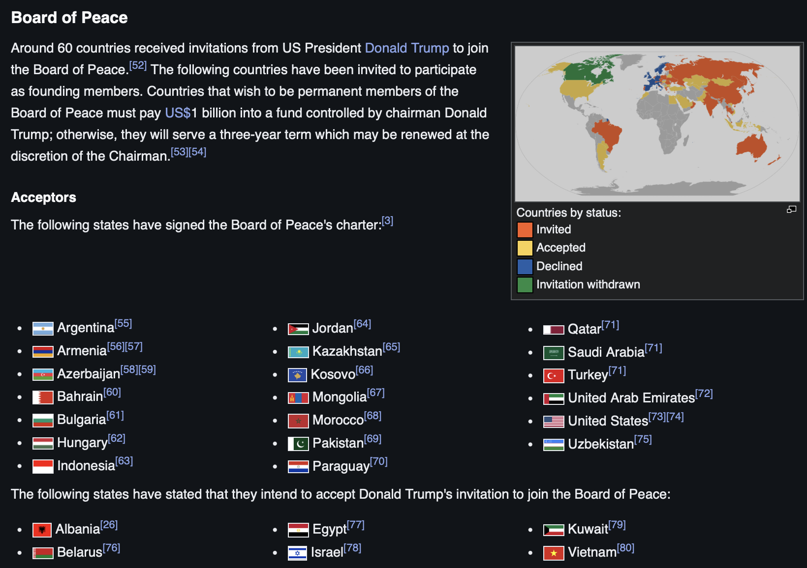

# OligarchRegistry.com

Available/In progress:

-   [Epstein Files Analysis](epstein-formatted-txt-2025-11-25-release.qmd): 
    -   [Parse and format with mt-digital/emails-network-processing](https://github.com/mt-digital/emails-network-processing/tree/main/R);
    - With this repository display, and visualize Epstein files emails
    -   Track various documentation sources, including when data was released, by whom, etc

Future ideas:

-   Tracking technogarchy investments in server farms, energy companies, compute power.
-   Host Enron email networks [e.g. from this Stanford resource provided by Jure Leskovec](https://snap.stanford.edu/data/email-Enron.html) — another resource [from R-bloggers](https://www.r-bloggers.com/2017/07/using-the-igraph-package-to-analyse-the-enron-corpus/)
-   Networks of Proud Boys & ICE with geospatial analyses
-   Board of Peace

------------------------------------------------------------------------

<i style="color: darkred">Ignorance is slavery. Self knowledge is liberation.</i>
